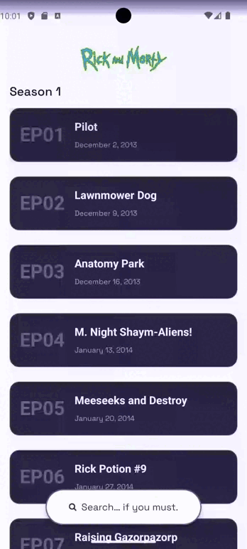

# The Rickdex 👽

A React Native (Expo + Ignite) app exploring the **Rick & Morty universe** — episodes, characters, and detailed views with search and clean UI.

Built with:

- ⚛️ React Native (Expo 54)
- 🔥 Ignite CLI
- 💜 TypeScript
- ⚡ Hermes
- 🧭 React Navigation
- 🚀 FlashList

---

## 🚀 How to Run the App

### 1️⃣ Install dependencies

```bash
npm install --legacy-peer-deps
```

### 2️⃣ Start the project

```bash
npm run start
```

Then:

- Press `i` → open iOS simulator
- Press `a` → open Android emulator
- Or scan the QR code

---

## 🏗 If a Development Build Is Required

If the app does not run in Expo Go, build a development client:

```bash
npm run build:ios:sim     # iOS simulator
npm run build:ios:device  # iOS physical device
npm run build:android     # Android device/emulator
```

After building:

```bash
npm run start
```

---

## 📱 Features

- Episodes list (FlashList v2)
- Search by episode name
- Character details screen
- Biometric-protected content (for specific characters)
- Error states with retry handling
- Clean Ignite architecture

---

## 🎥 App Demo

👉 I added short videos here showing the app in action:



Error state: 

---

## 📝 Notes for Reviewer

- Built with Ignite boilerplate.
- Clear separation between hooks, API layer (adapters), and UI components.
- Uses FlashList (instead of FlatList) for significantly better performance, improved memory usage, and smoother scrolling, especially on lower-end or small devices.
- Search implemented using lightweight string filtering.
- Custom search bar built with Reanimated v4. Fully animated expansion, smooth transitions, and keyboard-aware behavior for a polished, native-like interaction.
- Biometric Easter Egg; When attempting to access Rick Sanchez's data, the app requires biometric authentication (if enrolled on the device) using expo-local-authentication. Because let’s be honest… we need to verify you before revealing Rick-level classified intelligence.
